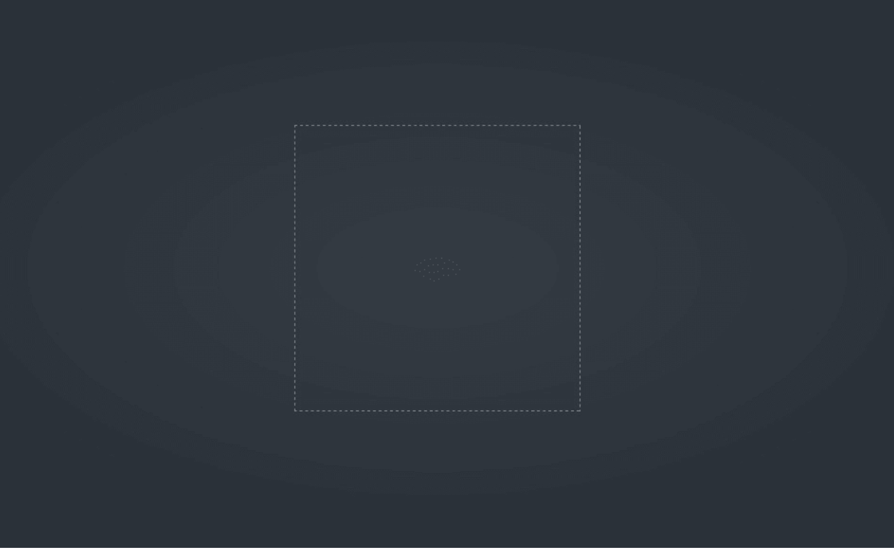
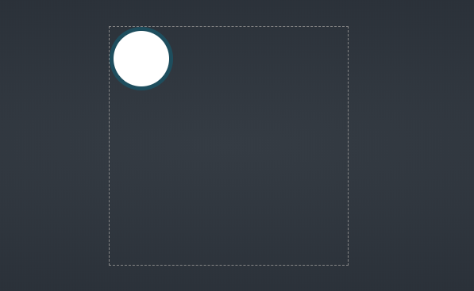
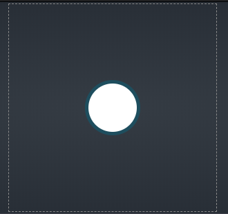
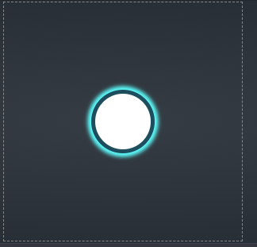

# 使用CSS3变形和动画制作钢铁侠的方舟反应堆
[原文] [Iron Man’s Arc Reactor Using CSS3 Transforms and Animations | CSS-Tricks](https://css-tricks.com/iron-mans-arc-reactor-using-css3-transforms-and-animations/)

[codepen](https://codepen.io/MissHoya/full/ERQbLw)

好了，钢铁侠迷们，启动你们的代码编辑器，我们将用CSS来制造钢铁侠衣服上的方舟反应堆。下面图片是我们应该制作的结果：


# 页面包装

我们将我们的方舟反应堆处于全屏黑暗背景下。以下是我们制作全屏包装元素的代码：

``` css
body {
  margin: 0;
}
.fullpage-wrapper {
  height: 100vh;
  background: radial-gradient(#353c44, #222931); //注意此处是径向渐变背景
}
```

为什么我们要在body中声明margin为空？因为在默认情况下，用户代理样式表会为`<body>`设置一些margin。这样可以防止`<body>`中的元素触碰到屏幕的边缘。由于我们希望我们的包装器能覆盖整个屏幕，乃至所有边缘，所以我们通过设置为0来移除了`<body>`元素的margin。

我们给了`.fullpage-wrapper`设置了视图的整个高度。我们没有定义宽度是因为div默认取父级总宽度。我们可以用另一种方法设置元素的宽高为`100%`，但是随着更多的元素被添加到屏幕上，可能会带来一些缺点。使用视窗单位可以保证我们的包装器始终占据屏幕的全部垂直空间，不管它是什么或者其他元素被添加到布局当中。

我们使用的css的`radial-gradient()`函数为我们的包装器使用了径向渐变。函数包含的参数是颜色的开始和结束点。因为，背景将会是从中心的`#353c44`颜色到`#222931`颜色的变化。很细微的变化，但是感觉很舒服。

<!--  -->


# 将反应堆容器定于中心

在我们开始创建我们的反应堆之前，我们先为他创建一个容器，并将它置于中心：

```css
.reactor-container {
  width: 300px;
  height: 300px;
  margin: auto;
  border: 1px dashed #888;
}
```

这里给我们了一个300 x 300带有虚线边框的盒子。它的`margin: auto`保证了水平居中。



但是为什么它不能垂直居中呢？

根据CSS2规范，如果我们设置margin左右为auto，那么整个可用空间将会平分给左右的margin。但是，这跟上下的margin不是同一种情况。对于上下的margin，CSS2规范有声明：

> *If margin-top, or margin-bottom are auto, their used value is 0.* <br /> 如果margin-top或者margin-bottom被设为auto，那么他们最终使用的值将是0

然而，我们有一个好消息。flexbox布局遵循了新的布局规则，在Flexbox 规范中有声明说：

> *Prior to alignment via justify-content and align-self, any positive free space is distributed to auto margins in that dimension.* <br /> 在通过`justify-content`和`align-self`对齐之前，任何确认可用的空间都将分配给自动边距

这就意味着如果元素被考虑作为flex元素显示，那么它的各个方向都设置的是`margin:auto`。我们将容器设置为flex容器，并且它的子元素也是flex：
```css
.fullpage-wrapper {
  width: 100%;
  height: 100vh;
  background: radial-gradient(#353c44, #222931);
  display: flex;
}
```
这是更好的方法。


在HTML中还有很多其他的方法可以让元素居中。在CSS-Tricks这里有一篇[居中指南](https://css-tricks.com/centering-css-complete-guide/)可以学习更多的方法。

# 反应堆芯：CSS中的同心圆
我们知道在HTML中创建新元素是从左到右，或者从上到下。除非你使用负的margin，否则元素绝对不会重叠。

因此，我们如何来展现同心圆？我们将要使用绝对定位。

`position`属性的默认值是`static`，`static`和`relative`定位遵循从上到下以及从左到右的原则。然而，一个被绝对定位的元素不被视为文档流的一部分，它可以使用`top, bottom, left, right`属性来定位到任何位置。

我们从创建最小的圆开始：
```html
<div class="fullpage-wrapper">
  <div class="reactor-container">
    <div class="core-inner"></div>
  </div>
</div>
```
```css
.core-inner {
  position: absolute;
  width: 70px;
  height: 70px;
  border-radius: 50%;
  border: 5px solid #1b4e5f;
  background-color: #fff;
}
```


我们需要将这个div居中。你可能会试图将我们应用在反应堆元素上来居中的flexbox概念应用于这个圆上。但是，在[CSS2规范](https://www.w3.org/TR/CSS22/visudet.html#abs-non-replaced-height)中有关于在绝对定位的元素上设置`margin:auto`的说法：
> If none of the three (top, height, and bottom) are auto: If both margin-top and margin-bottom are auto, solve the equation under the extra constraint that the two margins get equal values.

这意味着如果一个被绝对定位的元素，它的`top, bottom, height`的值都不为auto，然后将上边距和下边距都设置为`auto`将使元素垂直居中。

水平居中同理：如果一个被绝对定位的元素，它的`left, right, width`的值都不为auto，然后将左边距和右边距都设置为`auto`将使元素水平居中。

这以为着我们不需要用flexbox布局来居中一个拥有已知宽高的绝对定位的元素。我们只需要保证给`top, right, bottom, left`赋值除`auto`以外的值。因此，我们使用`0`:

```css
.core-inner {
  position: absolute;
  width: 70px;
  height: 70px;
  border-radius: 50%;
  border: 5px solid #1b4e5f;
  background-color: #fff;
  top: 0;
  left: 0;
  right: 0;
  bottom: 0;
  margin: auto;
}
```

我们不想在所有同心圆中重复这2行代码，因此我们将为它创建个独立的class。我们也不想为所有展示为圆的div声明`border-radius: 50%`，我们也可以为这个创建class：
```css.core-inner {
  width: 70px;
  height: 70px;
  border: 5px solid #1b4e5f;
  background-color: #fff;
}
.circle {
  border-radius: 50%;
}
.abs-center {
  position: absolute;
  top: 0;
  left: 0;
  right: 0;
  bottom: 0;
  margin: auto;
}
```
将这些新的class加到`.core-inner`元素上：
```html
<div class="fullpage-wrapper">
  <div class="reactor-container">
    <!-- the smallest circle -->
    <div class="core-inner circle abs-center"></div>
  </div>
</div>
```



好的，我们的同心圆居中了。让我们来将它发光。

但是，css中不存在“发光”的属性。

不要担心，我们有`box-shadow`属性，我们给它一个明亮的颜色替代灰色的阴影，使阴影看起来像是发光的。

```css
.core-inner {
  width: 70px;
  height: 70px;
  border: 5px solid #1b4e5f;
  background-color: #fff;
  box-shadow: 0px 0px 7px 5px #52fefe;
}
```


让我们休息一下来理解`box-shadow`的语法，因为我们将会在很多地方用到它。以下是阴影代表的意义的顺序：

- `x-offset`：我们向右侧推动阴影多少（x轴）。负值会将阴影推向左侧。
- `y-offset`：我们希望阴影向上或者下偏离多少（y轴）。
- `blur-radius`：我们希望阴影的模糊度是多少。
- `spread-radius`：我们希望阴影蔓延多少。
- `color`：阴影的颜色。


#翻译